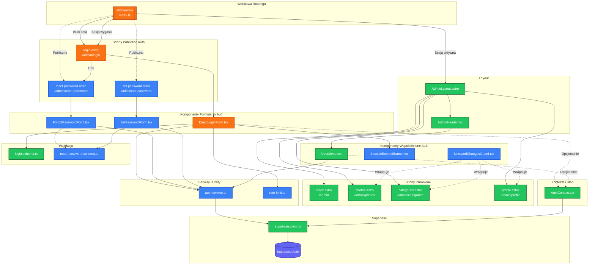

# Diagram Architektury UI - Moduł Autentykacji

## Opis

Diagram przedstawia architekturę interfejsu użytkownika modułu autentykacji dla aplikacji My Photo Portfolio. Uwzględnia istniejące komponenty oraz nowe elementy wymagane do pełnej implementacji funkcjonalności logowania, wylogowania, resetowania hasła i ochrony sesji.

## Legenda

- **Zielone** - istniejące komponenty (bez zmian)
- **Pomarańczowe** - komponenty wymagające modyfikacji
- **Niebieskie** - nowe komponenty do implementacji

---

<mermaid_diagram>



</mermaid_diagram>

---

## Szczegolowy opis komponentow

### Strony Astro

| Strona | Status | Opis |
|--------|--------|------|
| `login.astro` | Modyfikacja | Dodanie linku do resetu hasla, obsluga query params (returnTo, expired) |
| `reset-password.astro` | Nowa | Formularz zadania resetu hasla |
| `set-password.astro` | Nowa | Formularz ustawienia nowego hasla |
| `photos.astro` | Istniejaca | Zarzadzanie zdjeciami |
| `categories.astro` | Istniejaca | Zarzadzanie kategoriami |
| `profile.astro` | Istniejaca | Edycja profilu |

### Komponenty React

| Komponent | Status | Opis |
|-----------|--------|------|
| `DirectLoginForm.tsx` | Modyfikacja | Dodanie rate limiting, returnTo, komunikat wygasniecia |
| `ForgotPasswordForm.tsx` | Nowy | Formularz z polem email do resetu hasla |
| `SetPasswordForm.tsx` | Nowy | Formularz nowego hasla z potwierdzeniem |
| `SessionExpiredBanner.tsx` | Nowy | Alert o wygasnieciu sesji |
| `UnsavedChangesGuard.tsx` | Nowy | Ochrona przed utrata niezapisanych zmian |
| `UserMenu.tsx` | Istniejacy | Menu uzytkownika z wylogowaniem |
| `AuthContext.tsx` | Istniejacy | Kontekst zarzadzania stanem autentykacji |

### Middleware

| Plik | Status | Opis |
|------|--------|------|
| `middleware/index.ts` | Modyfikacja | Rozszerzenie o returnTo URL, wykrywanie wygasnietej sesji |

### Schematy walidacji

| Schemat | Status | Opis |
|---------|--------|------|
| `login.schema.ts` | Istniejacy | Walidacja formularza logowania |
| `reset-password.schema.ts` | Nowy | Walidacja resetu i ustawiania hasla |

### Serwisy i Utility

| Plik | Status | Opis |
|------|--------|------|
| `auth.service.ts` | Nowy | Abstrakcja nad Supabase Auth |
| `rate-limit.ts` | Nowy | Rate limiting prob logowania |

---

## Przeplywy uzytkownika

### 1. Logowanie

```
Uzytkownik → /admin/* → Middleware (brak sesji) → /admin/login
→ DirectLoginForm → auth.service → Supabase Auth
→ Sukces → /admin/photos
```

### 2. Reset hasla

```
Uzytkownik → /admin/login → Link "Nie pamietam hasla"
→ /admin/reset-password → ForgotPasswordForm → auth.service
→ Supabase wysyla email → Uzytkownik klika link
→ /admin/set-password → SetPasswordForm → auth.service
→ Sukces → /admin/login
```

### 3. Wygasniecie sesji

```
Uzytkownik wykonuje akcje → Middleware wykrywa wygasla sesje
→ /admin/login?expired=true&returnTo=... → SessionExpiredBanner
→ Ponowne logowanie → Powrot do poprzedniej strony
```

### 4. Wylogowanie

```
Uzytkownik → UserMenu → "Wyloguj" → auth.service.signOut()
→ /admin/login
```
